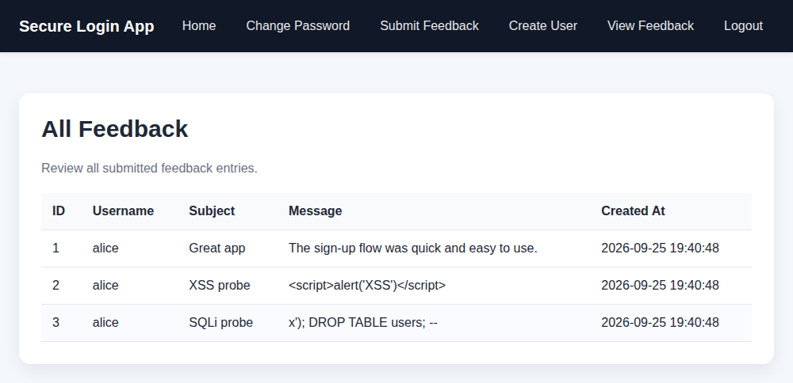
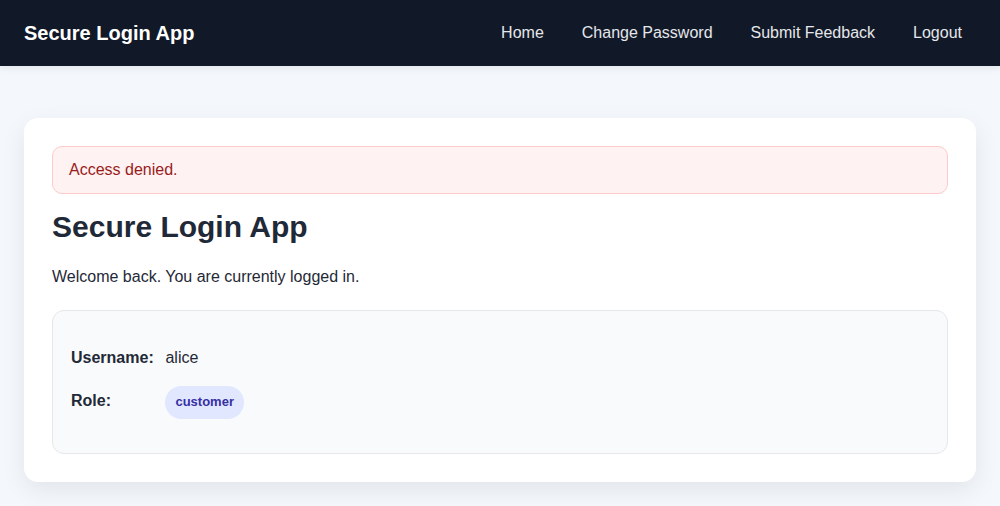
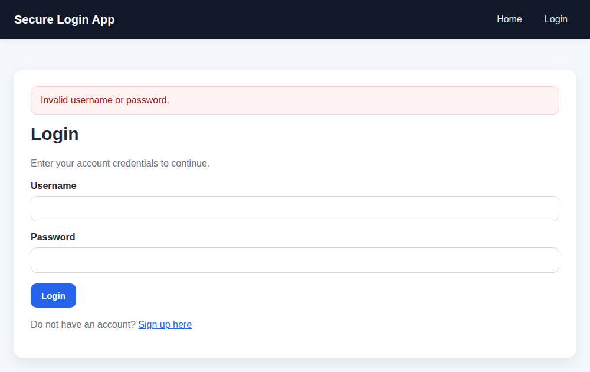
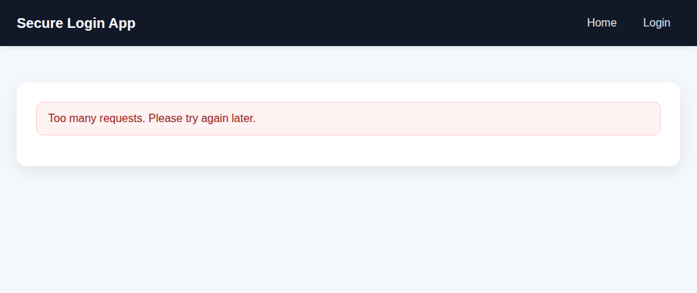

# Secure Login App

A small Flask web application built to practice secure software design: authentication, role-based access control and input handling, hardened against common web vulnerabilities and verified by **68 automated security tests mapped to CWE**.

Built for CS 4417 Software Security at the University of New Brunswick (Winter 2026).

## Features

- Login and logout with a 15-minute idle session timeout
- Customer self sign-up (always the least-privileged role)
- Change password, which requires the current password
- Admin-only user creation with role selection
- Feedback form for logged-in users and an admin-only feedback review page

## Security controls

| Threat | Control | CWE |
|---|---|---|
| SQL injection | Parameterized queries for every database call | CWE-89 |
| Cross-site scripting | Jinja2 auto-escaping plus a Content Security Policy that forbids inline scripts and styles | CWE-79 |
| Cross-site request forgery | CSRF token on every form (Flask-WTF); logout is POST-only | CWE-352 |
| Brute force | Login and sign-up limited to 5 attempts per minute and 20 per hour per IP | CWE-307 |
| Weak passwords | 15–64 characters, at most 72 bytes (bcrypt's limit), not equal to the username | CWE-521 |
| Password storage | bcrypt with a per-password salt | CWE-256, CWE-916 |
| Username enumeration | One generic login error; unknown users are checked against a dummy hash so response time matches | CWE-204, CWE-208 |
| Broken access control | Role re-read from the database on every protected request; sign-up can only create customers | CWE-285, CWE-269 |
| Session hijacking | Secure, HttpOnly, SameSite=Lax cookie; 15-minute idle timeout; session cleared on login and password change | CWE-614, CWE-1004, CWE-613 |
| Clickjacking | `X-Frame-Options: DENY` and `frame-ancestors 'none'` | CWE-1021 |
| Open redirect | Redirects only to same-origin URLs | CWE-601 |
| Hard-coded secrets | `SECRET_KEY` required from the environment; random admin password generated at setup | CWE-798 |
| Debug exposure | Debug mode off unless `FLASK_DEBUG=1` | CWE-489 |
| Invalid input | Username allowlist (letters, digits, `.` `_` `-`, 3–50 characters), case-insensitive uniqueness, length limits, role allowlist | CWE-20, CWE-178 |
| Sensitive data in cache | `Cache-Control: no-store` on dynamic pages | CWE-525 |

## Attack surface

| Route | Methods | Access | Protections |
|---|---|---|---|
| `/` | GET | Public | Shows the current user |
| `/login` | GET, POST | Public | Rate limited, generic errors |
| `/signup` | GET, POST | Public | Rate limited, password policy, always creates a customer |
| `/logout` | POST | Public | CSRF token required |
| `/change-password` | GET, POST | Logged in | Current password required, session cleared afterwards |
| `/feedback` | GET, POST | Logged in | Subject 3–100 and message 5–1000 characters |
| `/create-user` | GET, POST | Admin | Role must be `admin` or `customer` |
| `/feedback-list` | GET | Admin | All output HTML-escaped |
| `/static/style.css` | GET | Public | Only static asset |

## Screenshots

| XSS and SQL injection payloads stored as plain text | Customer blocked from an admin page |
|---|---|
|  |  |
| **Generic error for wrong credentials** | **Login throttled after repeated failures** |
|  |  |

## Getting started

Requires Python 3.10 or newer.

```bash
git clone https://github.com/phunguyen525/secure-login-app.git
cd secure-login-app
python3 -m venv venv
source venv/bin/activate
pip install -r requirements.txt
python -c "import secrets; open('.env','w').write('SECRET_KEY=' + secrets.token_hex(32))"
python init_db.py
python app.py
```

On Windows, create the environment with `python -m venv venv` and activate it with `venv\Scripts\activate`.

`init_db.py` prints a randomly generated admin password once. Save it, log in at http://127.0.0.1:5000 and change it.

### Configuration

| Variable | Required | Purpose |
|---|---|---|
| `SECRET_KEY` | Yes | Signs session cookies. The app refuses to start without it. |
| `ADMIN_PASSWORD` | No | Initial admin password instead of a random one. Must meet the password policy. |
| `FORCE_INSECURE_COOKIES` | No | Set to `1` only for local testing over plain HTTP if your browser does not keep you logged in. |
| `FLASK_DEBUG` | No | Set to `1` only for local development. |

## Security tests

```bash
python -m pytest -v
```

The suite in `tests/test_security.py` runs every test against a fresh temporary database, so it never touches `instance/app.db`. Each test name ends with the CWE it verifies:

```
tests/test_security.py::TestAuthentication::test_sql_injection_in_login_is_rejected_cwe_89[' OR '1'='1' --] PASSED [ 16%]
tests/test_security.py::TestAuthentication::test_login_timing_does_not_reveal_valid_usernames_cwe_208 PASSED [ 25%]
tests/test_security.py::TestAccessControl::test_demoted_admin_loses_access_immediately_cwe_285 PASSED [ 72%]
tests/test_security.py::TestInjectionAndXss::test_stored_xss_in_feedback_is_escaped_cwe_79 PASSED [ 75%]
tests/test_security.py::TestCsrf::test_csrf_error_never_redirects_off_site_cwe_601 PASSED [ 89%]
tests/test_security.py::TestRateLimiting::test_login_is_rate_limited_cwe_307 PASSED [ 92%]
============================= 68 passed in 22.51s ==============================
```

| Test class | What it verifies |
|---|---|
| `TestSecurityConfiguration` | Debug mode, cookie flags, security headers, CSP, caching, session lifetime |
| `TestAuthentication` | Login and logout, generic errors, SQL injection payloads, overlong passwords, timing |
| `TestPasswordPolicy` | Length rules, bcrypt storage, 72-byte limit, default admin password |
| `TestAccountManagement` | Least-privilege sign-up, username rules, case-insensitive uniqueness, password change |
| `TestAccessControl` | Anonymous, customer and admin access; demoted admins; deleted users |
| `TestInjectionAndXss` | Stored XSS, SQL injection in feedback, input length limits |
| `TestCsrf` | Missing and forged tokens, cross-site requests, safe error redirects |
| `TestRateLimiting` | Login and sign-up throttling |
| `TestRobustness` | Database path, foreign keys |
| `TestUserInterface` | Alert styles, navigation links |

## Project structure

```
app.py               Routes, access-control decorators, security headers
db.py                SQLite access, bcrypt hashing, password policy, admin setup
init_db.py           Creates the database and the default admin
schema.sql           Database schema
templates/           Jinja2 templates (auto-escaped)
static/style.css     Styles, kept out of the HTML so the CSP can block inline styles
tests/               pytest security test suite
.env.example         Configuration template
```

## Known limitations

- Sessions are signed cookies, so they cannot be revoked server-side. A stolen cookie keeps working after logout or a password change until it has been idle for 15 minutes (CWE-613). A server-side session store would fix this.
- Rate limits are kept in memory per process, so they reset on restart and are not shared between workers. A production deployment would need a shared store such as Redis.
- Rate limiting is per IP address. There is no per-account lockout and no multi-factor authentication.
- `python app.py` runs Flask's development server. A real deployment needs a WSGI server such as Gunicorn behind HTTPS.
- Authentication events are not written to an audit log.
